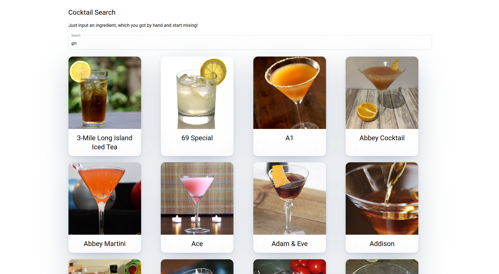

# Task

Welcome to your little Angular Task. 
To give you an impression what is the actual goal, there is a screenshot below. As a disclaimer, this task is not about design. 

The project should be set up with all the dependencies you need.
As always you can look them up in the [package.json](package.json).

## Description
This task is about building a cocktail search. The idea is that you have an ingredient in mind, which you would like to mix in. With this "tool" you can look up which cocktails include your ingredient.

Your task can be split into even smaller subtasks:
1. Build the searchbar and wire it up (either template driven or reactive - up to you). There's material installed, so make use of it.
2. While listening to the search input stream make API calls to fetch the cocktail list for the given ingredient.
3. Show the result set in a grid like structure.

There is no need to implement extra pages/ components/ services to solve this task. It is sufficient to stay within the main component.
(if you you want to implement more structures feel free...)
Loading animations, skeletons or error messages/handling are no part of the task as well.

## API
The [API](https://www.thecocktaildb.com/api.php) serves you with all data and thumbnails you need.

The endpoint for the ingredient search is already provided in the [environment](src/environments/environment.ts) file. Under [models](src/models/) you can find the two interfaces used by the API.

The search term needs to be passed in as a query param like: "i=Gin". No authorization needed.

## Installation

To get started please make your own fork and run `npm install` to get all dependencies installed.

## Development server

Run `ng serve` for a dev server. Navigate to `http://localhost:4200/`. The app will automatically reload if you change any of the source files.

## Interview

In the upcoming interview we would like to see your solution and have a little chat about your implementation and explanations.

Good Luck :)
